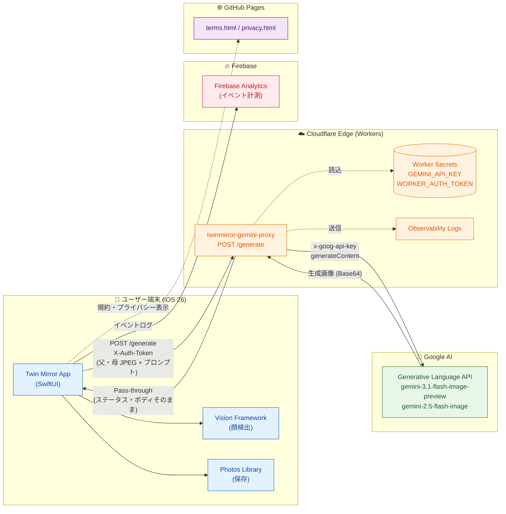
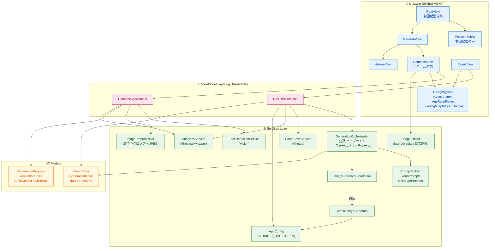
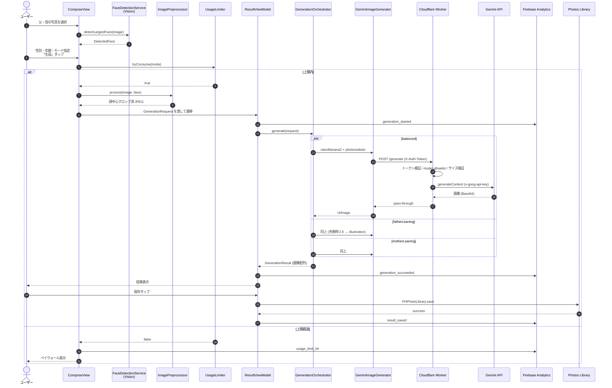
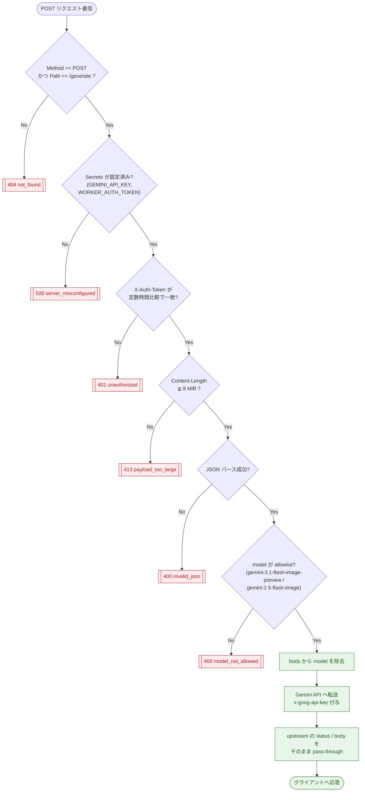
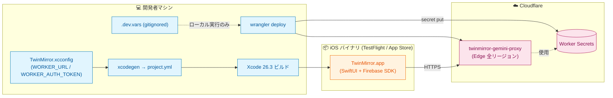

# Twin Mirror アーキテクチャ図

このドキュメントは Twin Mirror アプリ全体のシステムアーキテクチャを Mermaid.js で図解したものです。
GitHub / VS Code / Obsidian など Mermaid 対応ビューアでそのままレンダリングできます。

---

## 1. システム全体図 (High-Level Architecture)

iOS クライアント → Cloudflare Worker (プロキシ) → Google Gemini API という 3 層構成。
Gemini API キーは Worker 側 Secret に格納され、iOS バンドルからは取り除かれている。

---

## 2. iOS アプリ内部レイヤー構造

SwiftUI MVVM + サービスレイヤー。追加 SDK ゼロ方針で Vision / Photos / Foundation のみを使用。

---

## 3. 画像生成パイプライン (シーケンス図)

`premium` モードでは 3 つのブレンド比 (balanced / fatherLeaning / motherLeaning) を **並列** に
それぞれ独立したフォールバックチェーン (Nano Banana 2 → 2.5 → イラスト調) で実行する。

---

## 4. Cloudflare Worker リクエストフロー

Worker は薄いプロキシだが、認証・モデル制限・ボディサイズ検証など複数のゲートを通過する。

---

## 5. デプロイ・ビルド構成

iOS は Xcode/xcodegen でビルド、Worker は Wrangler で Cloudflare へデプロイ。
両者は `WORKER_URL` と `WORKER_AUTH_TOKEN` (共有シークレット) で結合される。

---

## 補足: 主要技術スタック

| レイヤー | 採用技術 |
|---|---|
| iOS UI | SwiftUI, iOS 26 Liquid Glass |
| iOS 状態管理 | `@Observable` (Swift 5.9+) |
| 顔検出 | Vision Framework (`VNDetectFaceRectanglesRequest`) |
| 画像保存 | Photos Framework (`PHPhotoLibrary`) |
| 計測 | Firebase Analytics |
| バックエンド | Cloudflare Workers (TypeScript) |
| デプロイツール | Wrangler |
| AI モデル | Gemini 3.1 Flash Image Preview (Nano Banana 2) → 2.5 Flash Image フォールバック |
| 静的ホスティング | GitHub Pages (規約・プライバシー) |
| 課金 (将来) | StoreKit 2 (premium モード解放) |
